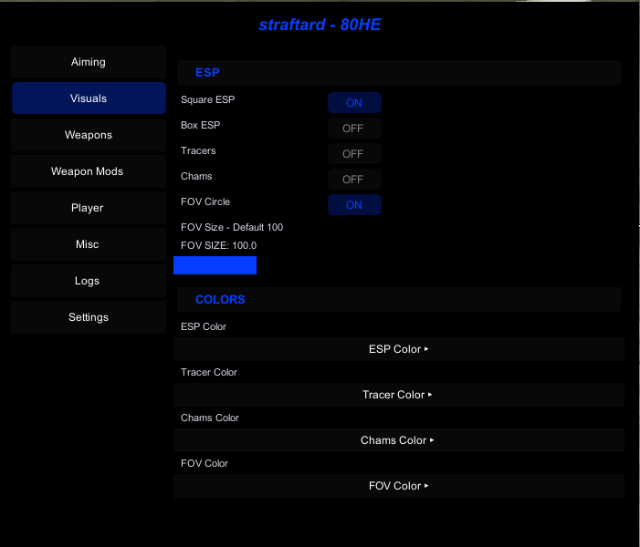
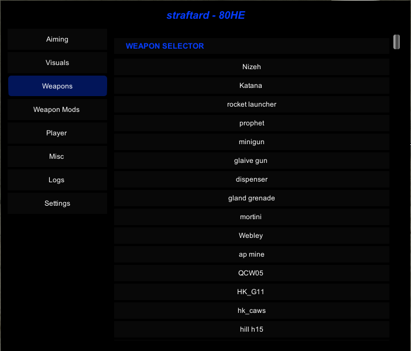
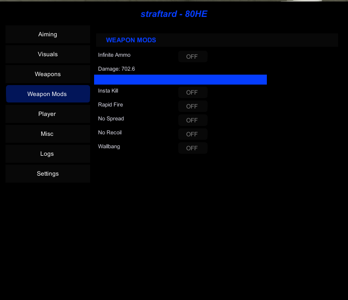
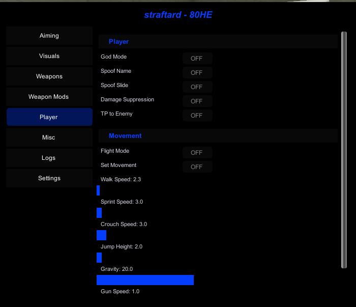
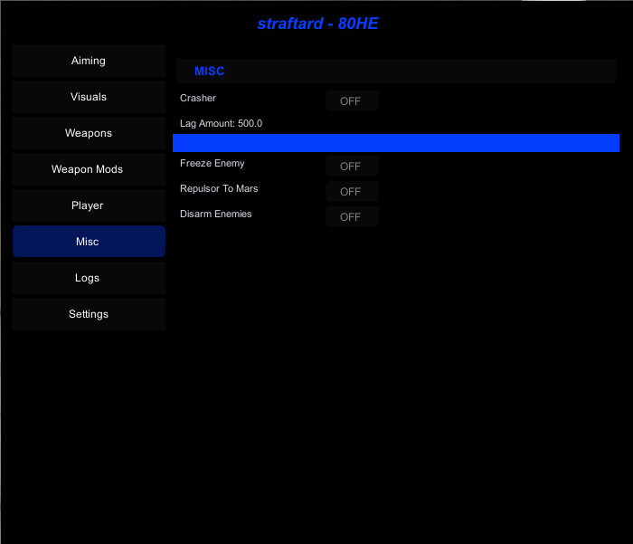
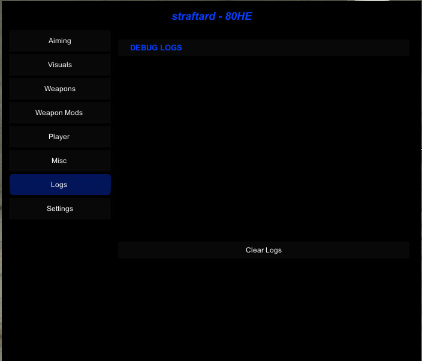
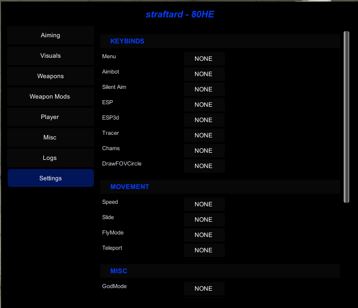
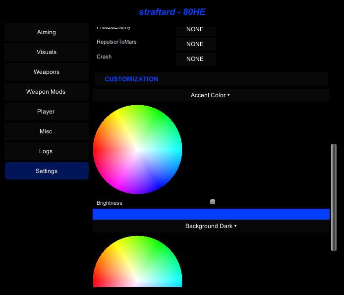

Straftat - 80he (Update 10/02/26 01)
➡️ [Feature Request](https://github.com/diddenbludden/Straftat-Cheats/issues/new/choose)
➡️ [Bug Report](https://github.com/diddenbludden/Straftat-Cheats/issues/new/choose)

# NEW MENU UPDATE!!
**New Weapons Tab**
- Weapons spawner
- Prop Spawner
  
**Improved the lag enemies to actually crash their games**

Preview (old): https://youtu.be/-vDy3y9Jds4
new showcase vid soon

How to Use

Download the Files
Go to the Releases section and download the following:

injector.exe — The main injector application

strafthot.dll — The DLL to be injected

SharpMonoInjector.dll - Injector DLL (injector wont work without this)

Optional: Build From Source
If you prefer not to use the precompiled binaries, both injector.exe and straftat.dll can be built manually from the source code. This ensures that you fully trust the binaries you are running.

Injection Process

Run injector.exe

Select the target process from the list

Choose the DLL (strafthot.dll) to inject

Click Inject to perform the injection

Visual Reference
# Features
# Aiming:
- Aimbot 
- Silent Aim
# Visuals:
- Esp (Flat Square)
- Esp (Box)
- Tracers
- Chams
- FOV (Aimbot)
- Spam Effects - Patched/Host sometimes works
- Spam Killfeed - Patched/Host sometimes works
# WeaponMods
- Inf Ammo
- Insta kill
- Rapid fire
- No spread
- No recoil
- Wallbang - Still works when hosting i think
# Movement
- Walkspeed
- SprintSpeed
- Gravity
- Crouch Speed
- Weapon Jump Height
- Weapon Wall jump limit
- Spoof Slide (Anti Aim)
- Grounded (Grounds your player model)
- Spoof Sprint Animation
- Spoof Scope FX
- Spoof Lean Animation
- TP to enemy 
- Flight
# Misc
- God mode
- Crasher - OP
- Damage suppression
- Freeze Enemy - Host only
- Repulsor to mars (makes the repulsor gun have crazy repulsion)
- Disarm Enemies - only fx for non Host
- Spoof name
- Unlock Achievments (F5)
# Settings
- Keybinds
- Theme customization

# Roadmap
- aimbot smoothing
- trying to find a workaround for wallbang
- Spoof name currently only works for people you dont have friended on steam
- ̶T̶h̶e̶m̶e̶ ̶c̶u̶s̶t̶o̶m̶i̶z̶a̶t̶i̶o̶n̶ ̶(̶E̶n̶t̶i̶r̶e̶ ̶m̶e̶n̶u̶ ̶g̶u̶i̶ ̶e̶d̶i̶t̶i̶n̶g̶)̶
- a̶d̶d̶i̶n̶g̶ ̶m̶o̶r̶e̶ ̶v̶i̶s̶u̶a̶l̶s̶ ̶l̶i̶k̶e̶ ̶e̶n̶e̶m̶i̶e̶s̶ ̶s̶c̶r̶e̶e̶n̶ ̶g̶o̶e̶s̶ ̶b̶l̶a̶c̶k̶ ̶o̶r̶ ̶l̶i̶k̶e̶ ̶a̶ ̶f̶l̶a̶s̶h̶b̶a̶n̶g̶,̶ ̶m̶a̶y̶b̶e̶ ̶s̶o̶m̶e̶ ̶T̶r̶a̶c̶e̶r̶s̶ ̶a̶n̶d̶ ̶a̶r̶r̶o̶w̶s̶
- r̶e̶a̶d̶d̶ ̶u̶n̶l̶o̶c̶k̶ ̶a̶c̶h̶i̶e̶v̶m̶e̶n̶t̶s̶ ̶-̶ ̶i̶t̶ ̶b̶r̶o̶k̶e̶ ̶a̶n̶d̶ ̶i̶ ̶w̶a̶s̶ ̶t̶o̶ ̶l̶a̶z̶y̶ ̶t̶o̶ ̶f̶i̶x̶ ̶i̶t̶
- m̶a̶k̶e̶ ̶m̶o̶v̶e̶m̶e̶n̶t̶ ̶r̶e̶l̶a̶t̶e̶d̶ ̶o̶p̶t̶i̶o̶n̶s̶ ̶m̶o̶r̶e̶ ̶f̶e̶a̶t̶u̶r̶e̶ ̶r̶i̶c̶h̶ ̶a̶n̶d̶ ̶p̶r̶o̶b̶a̶b̶l̶y̶ ̶f̶i̶n̶d̶ ̶a̶ ̶w̶o̶r̶k̶a̶r̶o̶u̶n̶d̶ ̶f̶o̶r̶ ̶s̶p̶e̶e̶d̶ ̶a̶n̶d̶ ̶j̶u̶m̶p̶ ̶s̶o̶ ̶y̶o̶u̶ ̶d̶o̶n̶t̶ ̶n̶e̶e̶d̶ ̶t̶o̶ ̶b̶e̶ ̶h̶o̶l̶d̶i̶n̶g̶ ̶a̶ ̶g̶u̶n̶
# NEW MENU!

This fork includes fixes and updates for better stability and usability
